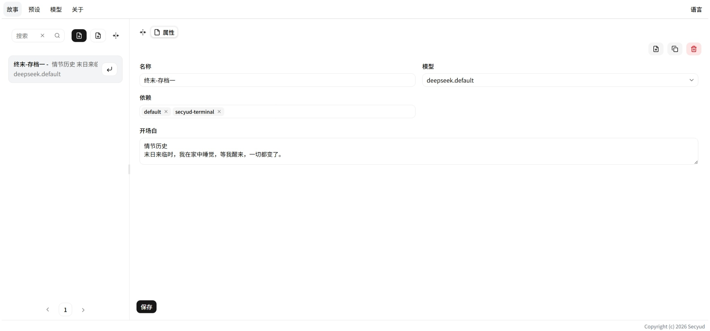
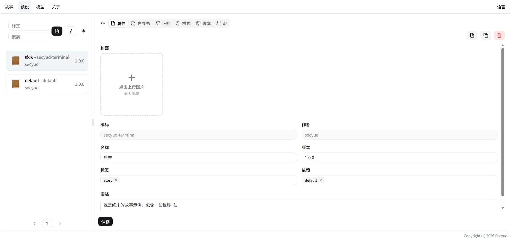

# 仪表板

左侧主导航栏包含三个标签：**故事**、**预设**、**LLM API**。

---

## 故事

故事是存档——绑定一个 LLM 模型和一组预设，记录对话历史和变量状态。

| 按钮 | 功能 |
|---|---|
| **创建** `+` | 新建故事 |
| **导入** `↓` | 从 JSON 文件导入故事 |
| **克隆** | 复制当前故事到新存档 |
| **导出** | 导出故事为 JSON 下载 |
| **删除** | 删除故事（不可恢复） |
| **↘** | 进入游玩界面 |

详情见 [故事](./stories/index.md)。

---

## 预设

可复用的内容包，包含世界书、宏、正则、脚本、样式。

| 按钮 | 功能 |
|---|---|
| **创建** `+` | 新建预设 |
| **导入** `↓` | 从文件导入预设 |
| **克隆** | 复制预设到新 Code |
| **导出** | 导出预设 |
| **删除** | 删除预设 |

预设列表支持按 **Tags** 筛选。详情见 [预设编辑器](./presets/index.md)。

---

## LLM API

管理大模型 API 配置。支持 DeepSeek 和 OpenAI 兼容协议。

| 按钮 | 功能 |
|---|---|
| **创建** `+` | 新建配置 |
| **导入** `↓` | 从 JSON 导入配置 |
| **导出** | 导出为 JSON（不含 Key） |
| **删除** | 删除配置 |

详情见 [LLM API](./llmapis/index.md)。
