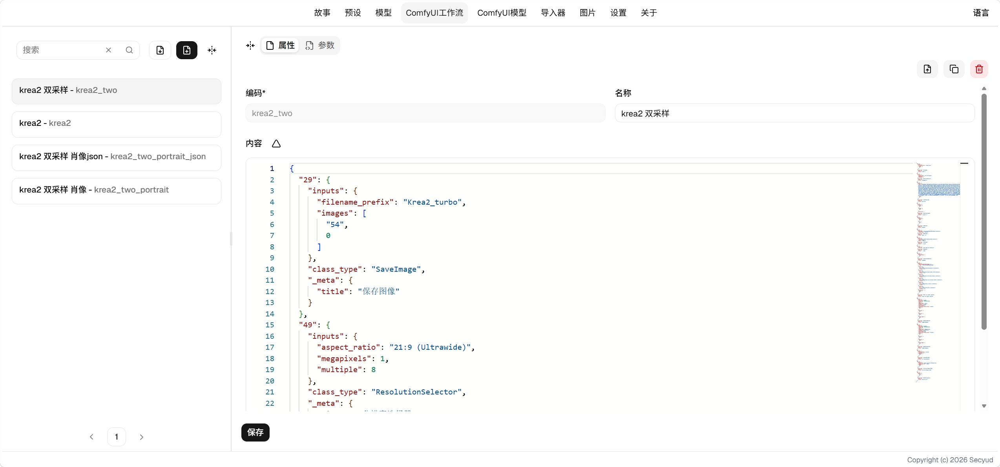
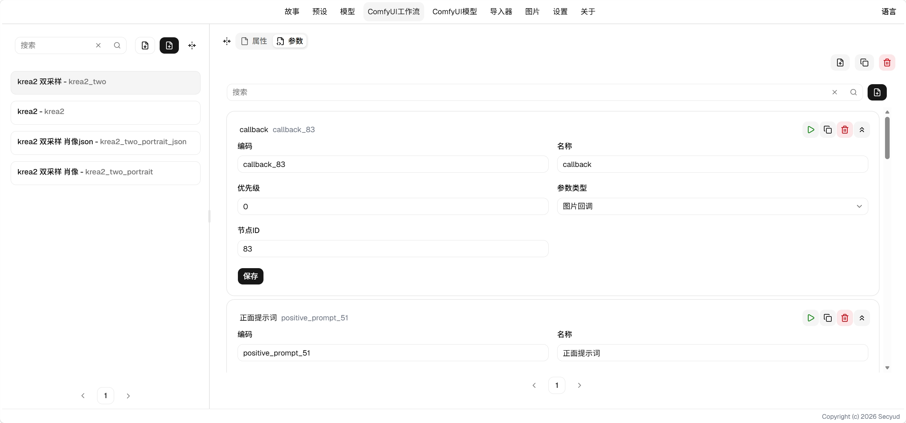

# ComfyUI Integration User Guide

## Model Management

Model management allows you to import models from model websites or create them manually for browsing and selecting models.

### Feature Descriptions

* Download Model to Server: If the model does not exist at the corresponding server path, you can download the model here.
* Link: A link to the model. Clicking it will open the model's homepage.

### Field Descriptions

* Cover: Upload an image cover. Choose between this and the cover URL.
* Cover URL: An external URL for the cover image.
* Code: The model's unique identifier.
* Name: The model's name, usually the series name.
* Type: The model's type.
    * diffusion_model
    * lora
    * text_encoder
    * vae
* Model Subpath: The model path accepted by ComfyUI. If you placed the model in a subfolder or changed the filename, set it here.
* Description: A detailed description of the model.
* Link: A link to the model, which can point to a model website.

## Workflow Management

Workflow management allows you to configure workflows. Workflows are used to send image generation information to ComfyUI for image generation.

### Properties

#### Field Descriptions

* Content: The workflow content, in JSON format.
* Description: Any descriptive text.

#### Generation Parameters

Some parameters are automatically generated. The following parameters will be generated:

* Model: The `unet_name` key will generate a `diffusion_model` model selector.
* Prompt: A key named positive `text` will generate an LLM prompt input field.
* Lora: The presence of a `Power Lora Loader (rgthree)` node will generate Lora selection boxes.
* Callback: The presence of a `Form Post Request Node` will generate a callback for saving images in the tavern.

### Parameters

The parameter interface allows you to configure parameters that will be replaced during image generation. The following types are available:

#### Model Select

* Node ID: The ID of the node to replace.
* Parameter Name: The name of the parameter to replace.
* Model Type: The type of model to select.
* Default Value: The default model to fill in.

#### Power Lora Select

Can only be applied to `Power Lora Loader (rgthree)` nodes.

* Node ID: The ID of the node to replace.
* Lora Count: The number of selectable Loras.
* Lora Checkbox: Can be enabled or disabled.
* Lora: Select the Lora to apply.
* Strength: The strength of the Lora.

#### Text Edit

Used for text editing.

* Node ID: The ID of the node to replace.
* Parameter Name: The name of the parameter to replace.
* Default Value: Fill in the default value.

#### Number Edit

Used for number editing, with a random number button. Can edit dimensions, seeds, etc.

* Node ID: The ID of the node to replace.
* Parameter Name: The name of the parameter to replace.
* Default Value: Fill in the default value.

#### AI Text Edit

Adds AI generation capability on top of text editing.

* Node ID: The ID of the node to replace.
* Parameter Name: The name of the parameter to replace.
* Prompt: Fill in the prompt for generating text, which will reference the current output of the gameplay.

#### Image Callback

Used for saving images. Images generated during gameplay will be saved to the story's image gallery via this parameter.

* Node ID: The ID of the node to replace.

#### Options

Used for selecting content.

* Node ID: The ID of the node to replace.
* Parameter Name: The name of the parameter to replace.
* Value Count: The number of selectable values.
* Value Definition: Define the options.
* Default Value: Fill in the default value.

### Settings

Make sure to configure the ComfyUI address before generating images.

#### Parameter Descriptions

* Address: The address of ComfyUI.
* Client ID: Your client name. You can define any name.
* Model Path: The path where the server downloads models. Fill in your ComfyUI model path.
    * Example: `/home/user/ComfyUI/models`

### Image Generation

1. Select the workflow you configured.
2. Fill in your parameters or keep the defaults. If there is an LLM-generated prompt, you need to click generate, or fill in the prompt yourself.
3. Click generate. The message will be sent to ComfyUI, and you can open ComfyUI to check if it has been added to the queue.
