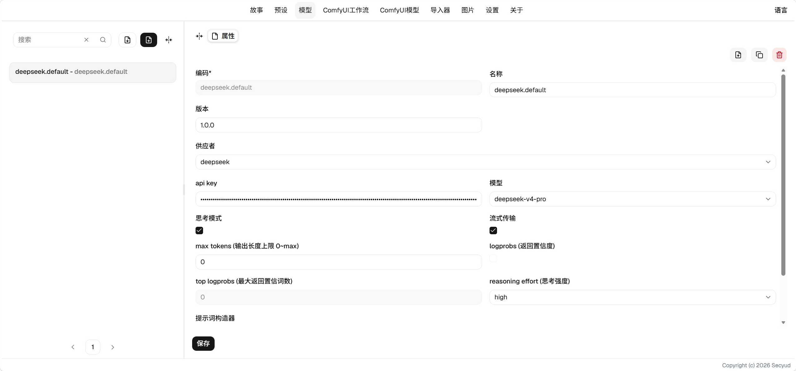

# Model User Guide

## Configure Your First LLM (Using DeepSeek as an Example)

1. Create a configuration, enter a code and name. Use English for the code as much as possible, as it serves as a unique identifier.
2. Select a provider. Here we choose DeepSeek.
3. Enter your API key obtained from the DeepSeek official website in the API Key field.
4. Choose the model you want to use, and configure thinking mode or non-thinking mode.
5. Click save. You can then select your configured model in the story's model settings.

## Properties

* Maximum turns per round: The maximum number of output rounds the AI can produce per round, showing how many times the AI calls tools in a single round.

* Provider: OpenAI
    * Default builder
        * Focuses on cache hit rate. The injected world books are cached in the corresponding history, thereby improving the hit rate.
    * Layered builder
        * Focuses on ordering. World books of different importance levels are injected by layer, thereby increasing the influence of important world books.

## Environment Variables

When the program initializes, if there is no `.env` file, one will be generated automatically, and the following values will be generated randomly. You can change them.

* `SECRET_SALT` Salt value, a complex string
* `SECRET_KEYS` Key, a complex string

These variables are involved in the encryption and decryption of the API keys in the database. Please handle them carefully to prevent leakage.
