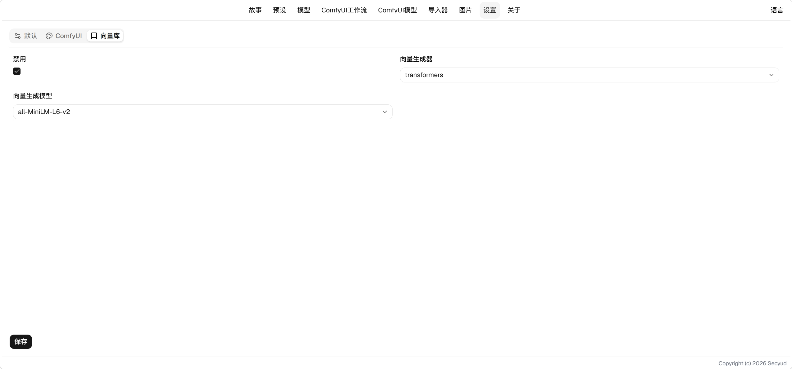

# World Book User Guide

## Field Descriptions

* Priority: The order in which world books are placed at the same level.
* Level: The order in which world books are placed. Levels below 100 are placed before user input; levels above are placed after user input.
* Role: The role used when sending world book content to the AI.
    * user: User input
    * system: System prompt
    * assistant: AI output
* Type: Determines the language recognition method for the editor.
* Match Type: Determines the matching method for whether the world book is applied. See [Matching](#matching).
* Content: The content that the world book injects into the context.

## Matching

### Always Active

Always injected into the context, by default placed before and after the first user message.

#### Field Description

* Last Message: The content of this world book will be placed before and after the last message of user input.

### General

Uses phrase matching. When the context contains the corresponding phrases, the world book will be injected.

#### Field Descriptions

* Match Count: The number of phrase groups that need to match.
* Keyword Group Count: The total number of phrase groups.
* Phrase Groups: The content of the phrases, stored as a string array.

> If any word in a phrase group appears in the context, the group is considered matched.
> When the number of matched phrase groups exceeds the match count, the world book will be injected.

### Event

Adds date relevance on top of [General](#general) matching.

#### Field Descriptions

* Min Date: The minimum date to include.
* Max Date: The maximum date to include.

> This entry will match the `relatedDates` in the current history variables. If a matching date exists, it will proceed to keyword matching; otherwise, it will not be injected.
> This match type requires a corresponding world book that instructs the AI to place relevant dates into the `relatedDates` array for it to work.

### Vector

Performs semantic matching based on vectors computed from the text. Semantic matching requires some time during initialization to generate the vector library, which will slow down opening the play interface. The effect is not as outstanding and is rarely used.

#### Settings

##### Field Descriptions

* Disabled: Disable vector matching. When disabled, no vector model download is needed.
* Vector Generator: The vector generation method.
    * transformers: Vector generator provided by HuggingFace, requires a vector generation model.
