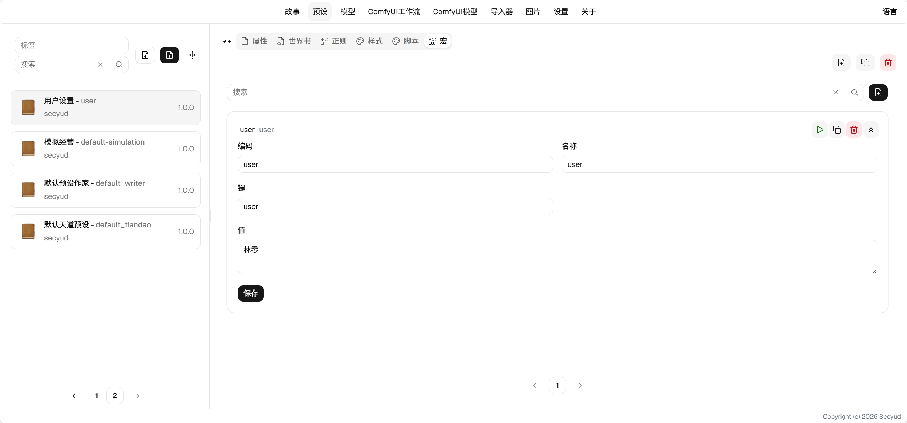

# Macros User Guide

## Field Descriptions

* Key: The key name in the `it` object within macro scripts.
* Value: The value corresponding to the key in the `it` object within macro scripts.

> Based on preset dependency hierarchy, keys with the same name will be overwritten by higher-priority presets.

## Usage

Assume a macro has a key `user` with value `Xiao Ming`. In any context text (including user input, AI output, world book, regex), using the template string `<%~ it.user %>` will evaluate to `Xiao Ming`. Inside blocks wrapped in `<%~ %>`, you can use JavaScript functions, for example `<%~ JSON.stringify(it.variables) %>` will display the serialized text of `variables`.

For more syntax documentation, refer to [Eta](https://eta.js.org/docs).

## Built-in Macros

In addition to configuring custom macros on the macros page, the system also has some built-in macros:

* variables: The current history variables.
