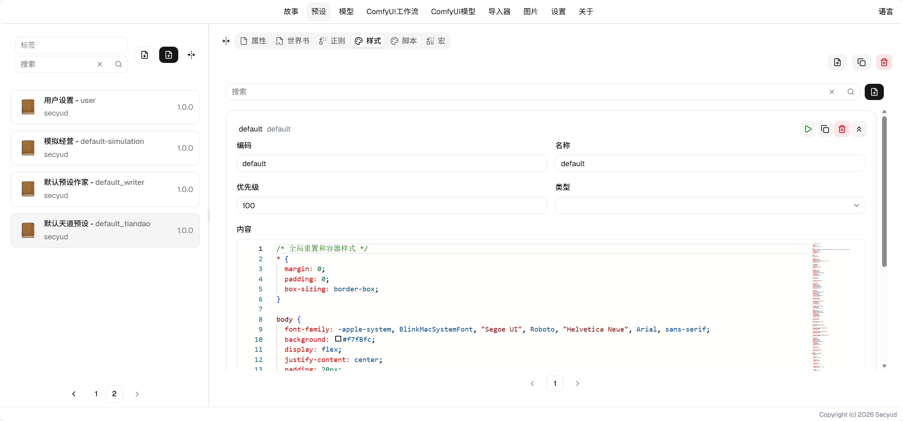
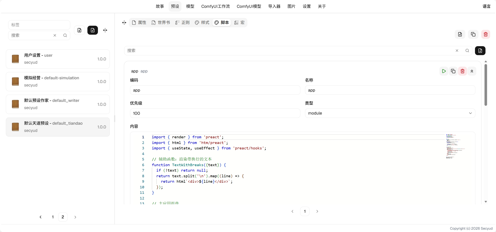

# Preset User Guide

## Configuring Your First Preset

1. Create a preset, enter a code and name. Use English for the code as much as possible, as it serves as a unique identifier.
2. Tag your preset. For example, if this preset includes themes and stories, add tags like `theme` and `story`, then click save.
3. Go to [World Book](#world-book) and configure the world book.
4. Go to [Regex](#regex) and configure regular expressions.
5. Go to [Styles](#styles) and configure styles.
6. Go to [Scripts](#scripts) and configure scripts.
7. Go to [Macros](#macros) and configure macros.
8. At this point, the preset is fully configured. You can select dependent presets in your story to start playing.

## Properties

Configure basic preset properties such as cover image, tags, version, dependencies, etc.

### Field Descriptions

* Cover: Upload a cover image to display for the preset.
* Version: The preset version, useful for tracking version progress when sharing.
* Tags: Preset categories, multiple tags are allowed for easier browsing.
* Dependencies: Other presets that this preset depends on, which will be loaded along with this preset.

## [World Book](lorebook.md)

World books provide a knowledge base that can match relevant content based on conditions and pass it to the AI as context.

## [Regex](regex.md)

Regex can search the context, find matching content, and replace it — either in the output or input.

## [Styles](style.md)

Styles define persistent CSS styles that are injected into the interaction page for rich UI rendering.

## [Scripts](script.md)

Scripts define JavaScript that is injected into the interaction page, providing rich interactive content.

## [Macros](macro.md)

Macros enable dynamic replacement during the output and input generation process.

## Q&A

1. Q: What is the difference between macros and regex?
    * A: Macros can perform dynamic computation and replacement, replacing both output and input, but can only match by expression. Regex has stronger matching capabilities, can replace output or input separately, but can only replace with relatively fixed content.
