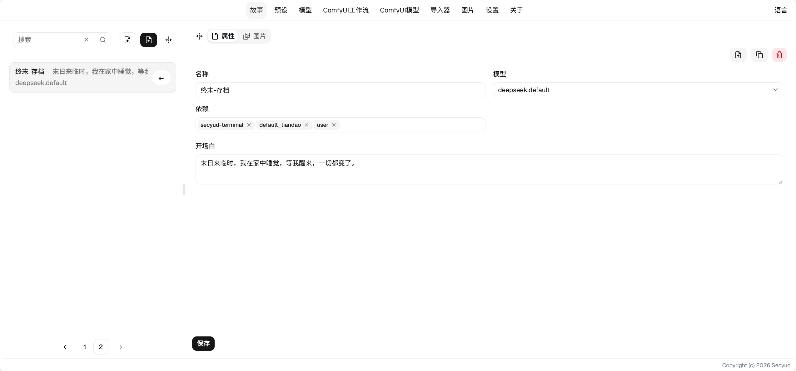

# Story User Guide

## Properties

### Field Descriptions

* Model: The model configuration created in [Models](../model/readme.md). Only one can be selected.
* Dependencies: The preset configurations created in [Presets](../preset/readme.md). Multiple can be selected.
* Opening: The first input generated when playing. Can be left empty.

## Images

Images related to this story. You can upload, download, and manage story images.

## Playing

Click the enter icon on the right side of a story item in the list to enter the [play interface](slot.md).

