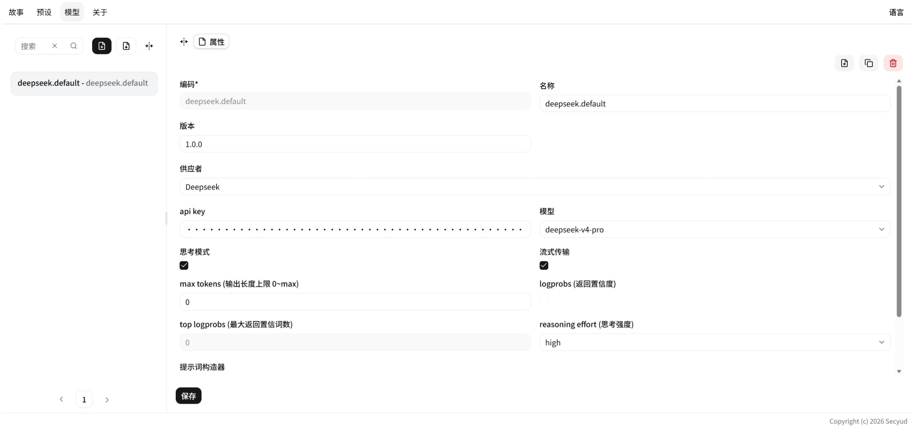

# LLM API

管理大模型 API 配置。选择一个配置后进入编辑器，包含 **属性**、**Provider**、**Builder** 三个区域。

## 属性

| 字段 | 说明 | 必填 |
|---|---|---|
| **Code** | 唯一标识符（如 `my-deepseek`） | ✅ |
| **Name** | 显示名称 | ✅ |
| **Version** | 语义版本号 | ✅ |

## Provider（服务商）

选择模型服务商并配置 API 参数。支持两种引擎，切换 Provider 下拉框实时切换配置表单。

详情见 [Provider](./provider/index.md)。

## Builder（上下文构建器）

控制如何将对话历史和激活的世界书拼接为发送给 LLM 的消息数组。

详情见 [Builder](./builder/index.md)。

## 操作

| 操作 | 说明 |
|---|---|
| **创建** | 新建配置 |
| **导入** | 从 JSON 导入配置 |
| **导出** | 导出为 JSON（不包含 API Key） |
| **删除** | 删除配置 |

