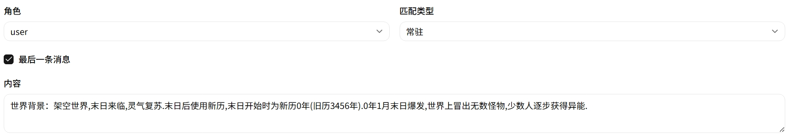

# 世界书 (Lorebook)

条件性背景知识注入引擎。条目通过匹配规则自动添加到 LLM 上下文。


## 条目字段

| 字段 | 说明 |
|---|---|
| **Code** | 唯一标识符 |
| **Name** | 显示名称 |
| **内容** | 注入的文本内容（支持 Eta 模板语法 `<%~ it.key %>`） |
| **Role** | 注入角色（`system` / `user` / `assistant`） |
| **Disabled** | 是否禁用 |

## 匹配模式

### 总是 (Always)

始终存在于上下文中，不依赖触发条件。



| 字段 | 说明 |
|---|---|
| **lastMessage** | 关闭：每轮都前置注入；开启：只在最后一条消息后注入 |
| **Layer（层级）** | `< 100` 置于用户输入之前，`≥ 100` 置于用户输入之后 |
| **Priority（优先级）** | 同层内排序，数值越大越靠后（越接近 AI 注意力） |

**示例**：角色基础设定（layer=0, lastMessage=false）在每轮对话开头固定注入；后置提醒（layer=100, lastMessage=true）在最后一条消息后注入，紧贴 AI 回复位置。

### 一般 (Normal)

关键字匹配模式。支持多组关键字，组内**或逻辑**，组间**满足数量逻辑**。


| 字段 | 说明 |
|---|---|
| **Keywords Groups** | 关键字组（每组对应一个输入框，组内任一命中即匹配该组） |
| **Keywords Group Count** | 组的数量（1-8） |
| **Fit Count** | 至少需要匹配的组数 |

**示例**：一个角色条目设置两组关键字——地点（蜀山、青城）和角色名（林渊、叶泠雪）。`fitCount=1` 表示命中任一组即触发；`fitCount=2` 表示必须同时提到地点和角色名才触发。

关键词匹配**不区分大小写**。

### 事件 (Event)

在一般匹配基础上增加**时间约束**。除了关键字条件，对话中还必须提及时间——即变量表中存在 `relatedDates`——且日期在条目的时间范围内。


额外字段：

| 字段 | 说明 |
|---|---|
| **minDate** | 最早触发日期（`{ year, month, day }`），为空表示无下限 |
| **maxDate** | 最晚触发日期，为空表示无上限 |

**示例**：事件条目"蜀山大阵开启"设定 `minDate={year:1,month:2,day:1}`，`maxDate={year:1,month:6,day:1}`。只有当对话中提及的时间落在这个范围内，且关键字也匹配时，条目才会激活。

适用场景：引导故事走向的伏笔和背景事件，让设定在合适的时机自然展开。

## 层级与优先级

层级不是连续深度，而是二分插入点：**Layer < 100 的内容放在用户输入之前，Layer ≥ 100 的内容放在用户输入之后。**

多个条目同时激活时：

1. 先按 Layer 分组：< 100 的前置组，≥ 100 的后置组
2. 同组内按 **Priority（优先级）** 排序——值越大越靠后（离 AI 越近）

```
前置组（Layer < 100）：
  Priority 50   ← 最先注入
  Priority 100  ← 稍后注入

--- 用户输入 ---

后置组（Layer ≥ 100）：
  Priority 10   ← 在用户输入之后
  Priority 50   ← 最后注入（离 AI 最近）
```

## 模板语法

世界书内容支持 Eta 模板语法引用宏变量：

```
<%~ it.sleep_var_wenfeng %>
<%~ JSON.stringify(it.variables) %>
```

系统在注入前用当前宏键值表渲染模板。
