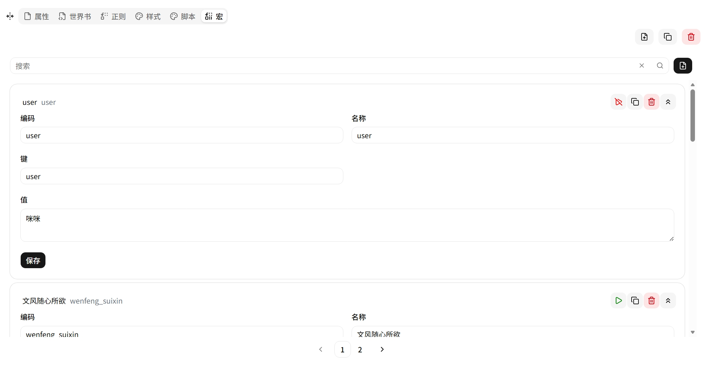

# 宏 (Macro)

键值对模板变量。通过 Eta 模板引擎 `<%~ it.key %>` 在上下文中替换占位符。

## 条目字段

| 字段 | 说明 |
|---|---|
| **Code** | 唯一标识符 |
| **Name** | 显示名称 |
| **Key** | 变量名（模板中的引用键） |
| **Value** | 变量值（支持文本和 Eta 语法） |
| **Disabled** | 是否禁用 |

## 使用示例

| Key | Value | 模板写法 | 渲染结果 |
|---|---|---|---|
| `mood` | `开心` | `<%~ it.mood %>` | `开心` |
| `world` | `艾尔德兰` | `<%~ it.world %>` | `艾尔德兰` |

## 互斥选项模式

多个宏可以共享同一个 Key，通过启用/禁用来切换取值。例如文风选择：

| Key | Name | Value | Disabled |
|---|---|---|---|
| `sleep_var_wenfeng` | 文风随心所欲 | `随心所欲，活灵活现...` | false |
| `sleep_var_wenfeng` | 文风萌系轻小说 | `萌系轻小说...` | true |
| `sleep_var_wenfeng` | 文风轻小说 | `轻小说...` | true |

只启用一个，其他的禁用。所有世界书和提示词中引用 `<%~ it.sleep_var_wenfeng %>` 的地方自动使用当前启用的取值。

系统加载预设时收集所有已启用宏的 Key-Value 合并为键值表，供世界书和提示词渲染使用。宏的值是纯文本，不进行模板语法递归，一般不引用其他宏。
