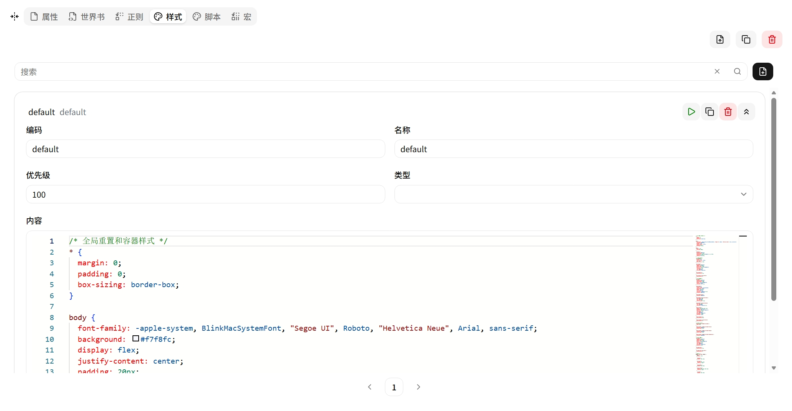

# 样式 (Style)

CSS 样式，注入到游玩界面 iframe 的 `<head>` 中。使用 Monaco 编辑器编写。



## 条目字段

| 字段 | 说明 |
|---|---|
| **Code** | 唯一标识符 |
| **Name** | 显示名称 |
| **Content** | CSS 代码 |
| **Priority** | 应用优先级（数值越小越先加载，后面的样式可覆盖前面的） |
| **Type** | 样式类型（默认空，普通 CSS） |
| **Disabled** | 是否禁用 |

## 注入方式

系统将样式内容包装为 `<style>` 标签，按 Priority 升序注入到 iframe 的 `<head>` 中：

```html
<head>
    <style>/* priority=100 的样式 */</style>
    <style>/* priority=200 的样式 */</style>
</head>
```

## 作用域

样式只作用于 iframe 内部，不影响主应用界面。多个预设的样式合并注入，后加载（高 Priority）的样式可覆盖先加载的。

iframe 的 DOM 结构由脚本决定，常用容器约定：

| 选择器 | 用途 |
|---|---|
| `#app` | 应用根容器 |
| `.container` | 内容包裹层 |
| `.user-input` | 用户输入消息 |
| `.ai-think` | AI 思考过程（可折叠） |
| `.think-header` | 思考区域标题栏 |
| `.think-content` | 思考内容区 |
| `.ai-output` | AI 正文输出 |
