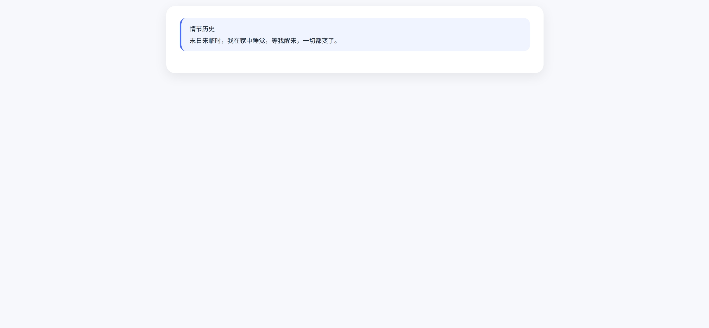
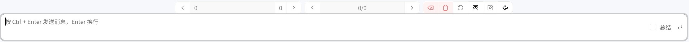
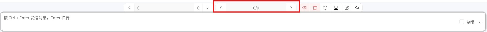

# 游玩界面

从故事列表点击 **↘** 进入。没有预设时界面为白色，加载预设后由脚本和样式渲染。



## 界面布局

| 区域 | 位置 | 说明 |
|---|---|---|
| 对话区 | 中央 | iframe 渲染，单楼层显示 |
| 输入栏 | 底部（悬停显示） | 消息输入框 |
| 功能按钮 | 底部（悬停显示） | 发送、翻页等 |
| 楼层导航 | 底部 | 上一页 / 下一页 |

输入栏和功能按钮默认隐藏，鼠标悬停到底部时出现。



## 发送消息

1. 鼠标移到底部，输入栏滑出
2. 输入消息
3. **Ctrl + Enter** 发送（Enter 换行）
4. AI 回复流式渲染——逐 token 出现

## 渲染流程

### 1. 初始加载 / 翻页

进入页面或切换楼层时，系统向 iframe 注入完整数据：

```
window.__messageData = { content: renderContent }
→ 注入 scripts（按 priority 升序）
→ 注入 styles（按 priority 升序）
→ 脚本执行，读取 window.__messageData 渲染界面
```

`renderContent` 数据结构：

| 字段 | 说明 |
|---|---|
| `inputs` | 用户输入消息列表（`string[]`） |
| `output` | AI 正文输出 |
| `reasoningContent` | AI 思考过程（DeepSeek Thinking 模型专有，其他模型为空） |

### 2. 流式输出

AI 回复时，`postMessage` 逐 token 推送 `streamContent` 消息：

```
streamContent → { output: "逐token增长的文本" }
streamContent → { output: "逐token增长的文本..." }
...
renderContent → { inputs, output, reasoningContent }  ← 最终完整数据
```

流式输出**不包含** `reasoningContent`——思考内容只在最终的 `renderContent` 中一次性返回。

### 3. 变量更新

变量变更时推送 `variables` 消息，iframe 脚本自行处理。

## 思考内容渲染

启用 DeepSeek Thinking 时，模型在输出正文前先生成内部推理。系统将推理和正文分开：

- `reasoningContent`：思考过程
- `output`：去掉思考后的正文

脚本通常将思考内容放在可折叠区域中：

```js
{data.reasoningContent && html`
    <div class="ai-think">
        <div class="think-header" onClick=${toggle}>
            💭 思考过程 ${isOpen ? '▼' : '▶'}
        </div>
        ${isOpen && html`<div class="think-content">...</div>`}
    </div>
`}
{data.output && html`<div class="ai-output">...</div>`}
```

## 楼层翻页

对话按楼层分页，一个界面只显示一个楼层。

| 按钮 | 功能 |
|---|---|
| **← 上一页** | 查看之前的楼层 |
| **→ 下一页** | 查看之后的楼层 |


## 多分支输出

每条用户消息可以有多个 AI 回复分支，通过切换按钮查看不同分支，重新生成按钮请求新回复。



## 变量系统

AI 回复中嵌入 `<variable_changes>` 标签自动解析并剔除：

```text
<variable_changes>
[{"op": "add", "path": "time/hour", "value": 23}]
</variable_changes>
```

| 字段 | 说明 |
|---|---|
| **op** | `add` / `replace` / `remove` |
| **path** | 变量路径，点号分隔（如 `alice.mood`） |
| **value** | 新值（remove 不需要） |

系统自动应用到变量表，标签内容从正文剔除。变量通过 `postMessage({ type: "variables", data: {...} })` 同步到 iframe。

## 总结

标记消息为 summary 后，之前的内容在拼接提示词时被忽略，有效控制上下文长度。
