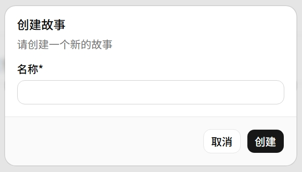

# 故事

故事是存档——绑定一个 LLM 模型和一组预设，记录对话历史和变量状态。


## 创建故事



| 字段 | 说明 | 必填 |
|---|---|---|
| **Name** | 故事名称 | ✅ |
| **LLM API** | 选择已配置的模型 API | 可选 |
| **Requires** | 选择需要加载的预设（可多选） | 可选 |
| **Opening Remarks** | 开场白 / 系统提示词 | 可选 |

## 操作

| 操作 | 说明 |
|---|---|
| **创建** `+` | 新建故事 |
| **导入** `↓` | 从 JSON 导入故事 |
| **克隆** | 复制到新存档 |
| **导出** | 导出为 JSON |
| **删除** | 删除故事 |
| **↘ 进入** | 跳转到 [游玩界面](../slots/index.md) |

## 变量系统

AI 回复中嵌入 `<variable_changes>` 标签自动解析并剔除：

```text
<variable_changes>
[{"op": "add", "path": "time/hour", "value": 23}]
</variable_changes>
```

| 字段 | 说明 |
|---|---|
| **op** | `add` / `replace` / `remove` |
| **path** | 变量路径，点号分隔（如 `alice.mood`） |
| **value** | 新值（remove 不需要） |

## 总结

标记消息为 summary 后，之前的内容在拼接提示词时被忽略，有效控制上下文长度。
