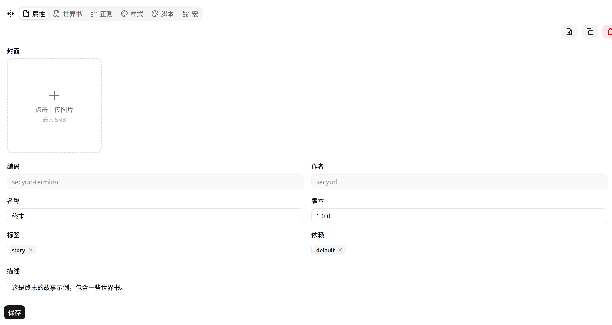
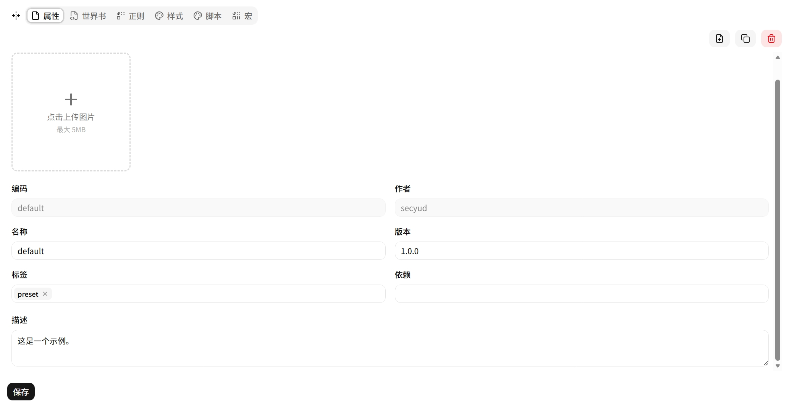

# 预设编辑器

选择一个预设后进入分页编辑器，顶部分页栏包含 **属性** 和五种引擎标签。

## 属性

| 字段 | 说明 |
|---|---|
| **封面** | 上传 PNG 封面图（可选） |
| **Code** | 唯一标识符，创建后不可修改 |
| **Name** | 显示名称 |
| **Version** | 语义版本号 |
| **Tags** | 分类标签（可多选，支持自由输入） |
| **Requires** | 依赖的其他预设 |
| **Description** | 描述文本（Markdown 格式） |

## 引擎子页

| 引擎 | 说明 |
|---|---|
| [世界书](./lorebooks/index.md) | 条件性背景知识注入，三种匹配模式 |
| [宏](./macros/index.md) | 键值对模板变量，Eta 引擎替换 |
| [正则](./regexes/index.md) | 文本查找替换，发送前/展示后双向过滤 |
| [脚本](./scripts/index.md) | JavaScript 注入 iframe，自定义渲染 |
| [样式](./styles/index.md) | CSS 注入 iframe，自定义外观 |
