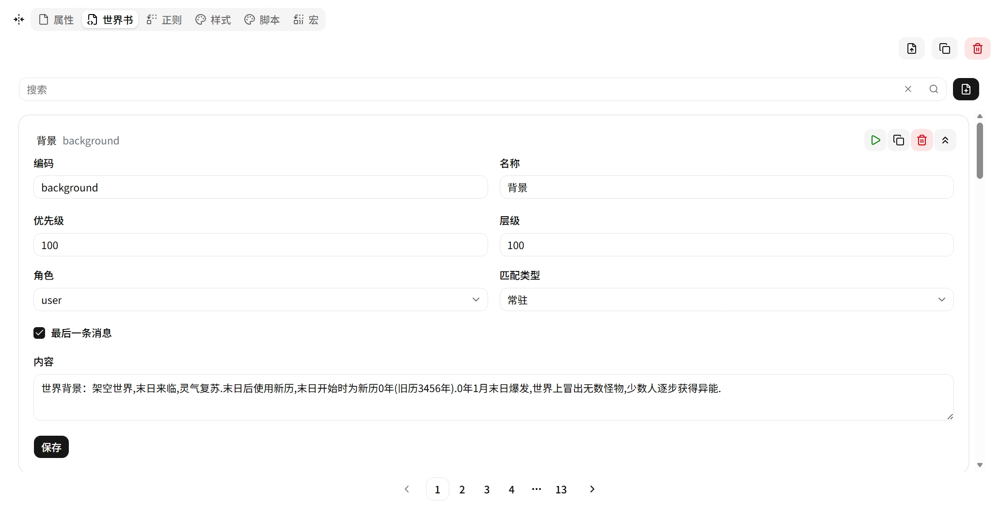
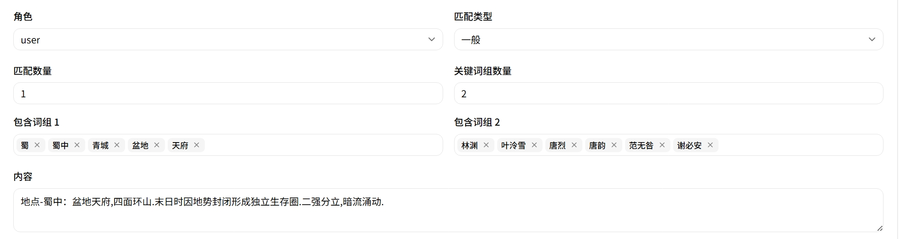
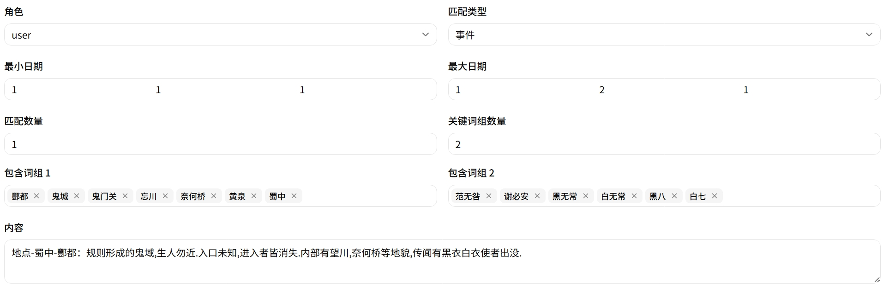

# 世界书 (Lorebook)

条件性背景知识注入引擎。条目通过匹配规则自动添加到 LLM 上下文。

## 条目字段

| 字段 | 说明 |
|---|---|
| **Code** | 唯一标识符 |
| **Name** | 显示名称 |
| **内容** | 注入的文本内容（支持 Eta 模板语法） |
| **Role** | 注入角色（system / user / assistant） |
| **Disabled** | 是否禁用 |

## 匹配模式

### 总是 (Always)

始终存在于上下文中，不依赖触发条件。

| 字段 | 说明 |
|---|---|
| **lastMessage** | 关闭：每轮都前置注入；开启：只在最后一条消息后注入 |
| **Layer（层级）** | `< 100` 内容置于消息前，`≥ 100` 置于消息后 |
| **Priority（优先级）** | 同层内排序，数值越大越靠后 |

### 一般 (Normal)

关键字匹配。支持多组关键字，组内**或逻辑**，组间**满足数量逻辑**。

| 字段 | 说明 |
|---|---|
| **Keywords Groups** | 关键字组（最多 8 组） |
| **Keywords Group Count** | 组的数量 |
| **Fit Count** | 至少需要匹配的组数 |

**示例**：三组关键字——地点（学校、商店）、特征（长发、眼镜）、性格（温柔、内向）。`fitCount = 2` 表示需同时命中至少两组。

### 事件 (Event)

在一般匹配基础上增加**时间匹配**——还需变量表中存在 `relatedDates` 才触发。

