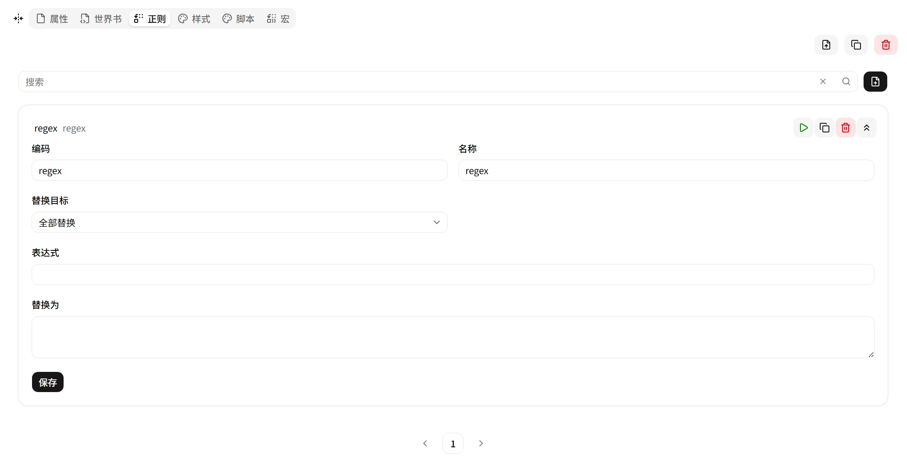

# 正则 (Regex)

文本查找替换规则。在消息发送前和展示后对文本做正则替换。

| 字段 | 说明 |
|---|---|
| **Code** | 唯一标识符 |
| **Name** | 显示名称 |
| **Pattern** | 正则表达式（JavaScript 语法） |
| **Replacement** | 替换文本 |
| **Target** | `input`（输入时）/ `output`（输出时）/ `both`（双向） |

## 使用示例

| Pattern | Replacement | Target | 效果 |
|---|---|---|---|
| `\*{3,}` | `**` | `both` | 统一多余星号 |
| `<think[^>]*>[\s\S]*?</think>` | （空） | `output` | 剔除思考标签 |
