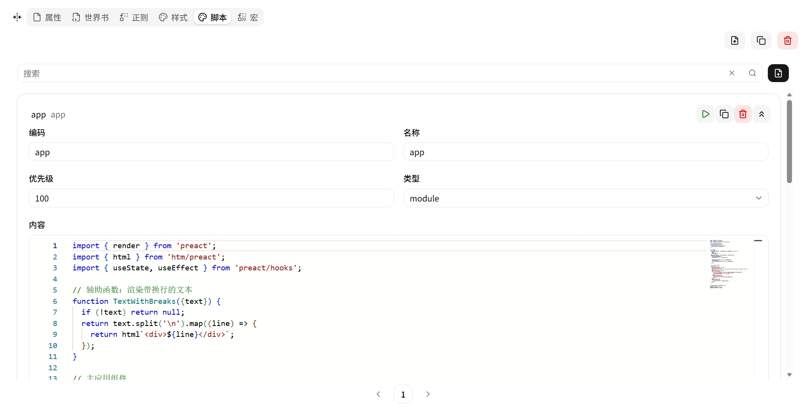

# 脚本 (Script)

JavaScript 代码，注入到游玩界面 iframe 中执行。使用 Monaco 编辑器编写。

| 字段 | 说明 |
|---|---|
| **Code** | 唯一标识符 |
| **Name** | 显示名称 |
| **Content** | JavaScript 代码 |
| **Priority** | 执行优先级（数值越大越后执行） |
| **Type** | 脚本类型（js） |
| **Disabled** | 是否禁用 |

## iframe 通信

脚本通过 `postMessage` 接收消息：

| 消息类型 | 触发时机 |
|---|---|
| `streamContent` | AI 流式输出时 |
| `renderContent` | 翻页 / 初始加载 |
| `variables` | 变量更新 |
| `slot` | Slot 初始化 |
