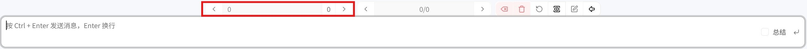

# 游玩界面

从故事列表点击 **↘** 进入。没有预设时界面为白色，加载预设后由脚本和样式渲染。

## 界面布局

| 区域 | 位置 | 说明 |
|---|---|---|
| 对话区 | 中央 | iframe 渲染，单楼层显示 |
| 输入栏 | 底部（悬停显示） | 消息输入框 |
| 功能按钮 | 底部（悬停显示） | 发送、翻页等 |
| 楼层导航 | 底部 | 上一页 / 下一页 |

输入栏和功能按钮默认隐藏，鼠标悬停到底部时出现。

## 发送消息

1. 鼠标移到底部，输入栏滑出
2. 输入消息
3. **Ctrl + Enter** 发送（Enter 换行）
4. AI 回复流式渲染——逐 token 出现

## 楼层翻页

对话按楼层分页，一个界面只显示一个楼层。

| 按钮 | 功能 |
|---|---|
| **← 上一页** | 查看之前的楼层 |
| **→ 下一页** | 查看之后的楼层 |

## 多分支输出

每条用户消息可以有多个 AI 回复分支，通过切换按钮查看不同分支，重新生成按钮请求新回复。

## iframe 消息

预设脚本通过 `postMessage` 接收消息实现自定义渲染：

| 消息类型 | 触发时机 | 数据 |
|---|---|---|
| `streamContent` | 流式输出时 | `{ output }` |
| `renderContent` | 翻页/初始加载 | `{ inputs[], output }` |
| `variables` | 变量更新时 | 变量键值表 |
| `slot` | 初始化时 | 完整运行时数据 |
