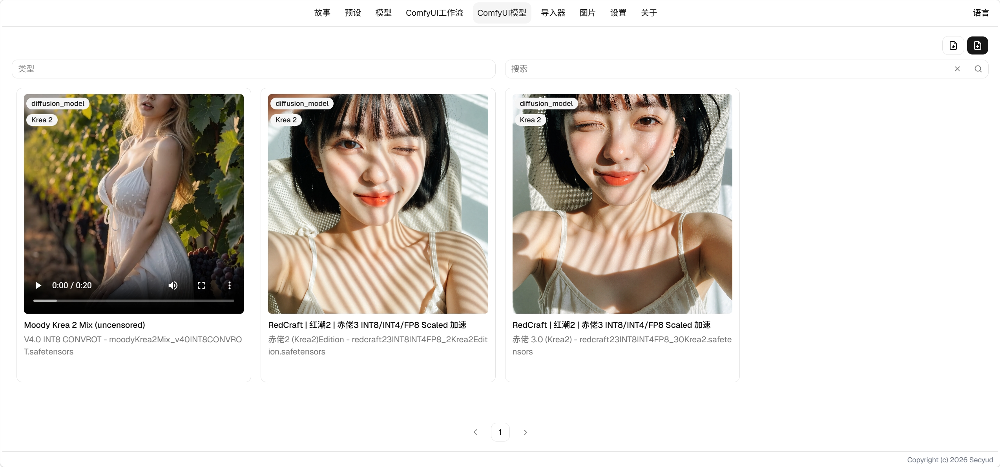
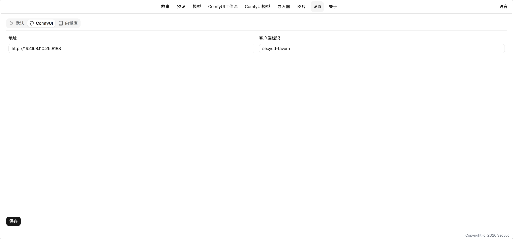
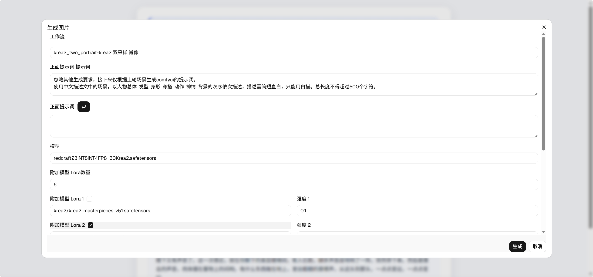

# ComfyUI集成 使用指南

## 模型管理

模型管理可以从模型网站导入模型或者手动创建，用于浏览，选择模型。

### 功能说明

* 下载模型到服务器：如果服务器相应路径下没有模型，可以通过这个下载模型
* 链接：模型的链接，点击会跳转到模型主页

### 字段说明

* 封面：上传的图片封面，与封面地址二选一。
* 封面地址：封面的外链地址。
* 编码：模型的唯一标识符
* 名称：模型的名称，通常是系列名称
* 类型：模型的类型
    * diffusion_model
    * lora
    * text_encoder
    * vae
* 模型子路径，ComfyUI接受的模型路径，如果你放到了子文件夹或者修改了文件名，需要在这里设置
* 描述：模型的具体描述
* 链接：模型的链接，可以链接到模型站

## 工作流管理

工作流管理可以配置工作流，利用工作流将生图信息发送给ComfyUI进行生图。

### 属性

#### 字段描述

* 内容：工作流的内容，是一个Json。
* 描述：随便写点什么。

#### 生成参数

自动生成一些参数，有以下参数会被生成

* 模型：`unet_name`键将会生成一个`diffusion_model`模型选择。
* 提示词：名称为positive`text`键将会生成一个llm生成提示词的输入框。
* Lora：存在`Power Lora Loader (rgthree)`节点将会生成Lora选择框。
* 回调：存在`Form Post Request Node`节点将会生成回调，用于在tavern保存图片。

### 参数

参数界面可以配置生图时替换的参数，有以下几种类型可供选择

#### 模型选择

* 节点ID：替换的节点ID
* 参数名称：替换的参数名称
* 模型类型：需要选择的模型类型
* 默认值：默认填充的模型

#### Power Lora 选择

只能应用在`Power Lora Loader (rgthree)`节点

* 节点ID：替换的节点ID。
* Lora 数量：可选择的Lora数量。
* Lora 复选框：可以启用，禁用。
* Lora：选择应用的Lora。
* 强度：Lora的强度

#### 文字编辑

用于文字编辑

* 节点ID：替换的节点ID
* 参数名称：替换的参数名称
* 默认值：填写默认值

#### 数字编辑

用于数字编辑，提供随机数按钮，可以编辑长宽，种子等。

* 节点ID：替换的节点ID
* 参数名称：替换的参数名称
* 默认值：填写默认值

#### AI文字编辑

文字编辑的基础上添加了AI生成的功能

* 节点ID：替换的节点ID
* 参数名称：替换的参数名称
* 提示词：填写生成文字的提示词，会引用游玩的当前输出

#### 图片回调

用于保存图片，游玩中生成的图片将会借助这个参数保存到故事图片中。

* 节点ID：替换的节点ID

#### 选项

用于选择一些内容。

* 节点ID：替换的节点ID
* 参数名称：替换的参数名称
* 值数量：可选值的数量
* 值定义：定义选项
* 默认值：填写默认值

### 设置

生图前务必配置`ComfyUI`的地址。

#### 参数描述

* 地址：`ComfyUI`的地址。
* 客户端标识：自己客户端的名称，可以随便定义一个。
* 模型路径：服务器下载模型的路径，填写你的ComfyUI模型路径。
    * 例如：`/home/user/ComfyUI/models`

### 生图

1. 选择我们配置的工作流
2. 填入我们的参数或保持默认，如果有LLM生成提示词，需要点击生成，或自己填写提示词。
3. 点击生成，消息将发送给`ComfyUI`，你可以进入`ComfyUI`查看是否已经加入队列。