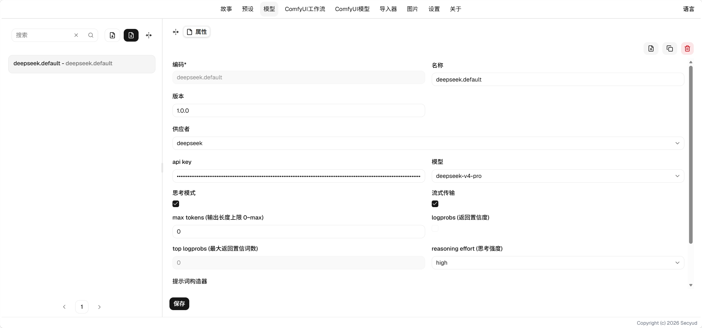

# 模型使用指南

## 配置你的第一个LLM (以Deepseek为例)

1. 创建一个配置，输入编码和名称。编码尽量用英文，作为唯一标识符。
2. 选择供应者，这里我们选择Deepseek。
3. 在api key栏输入你从Deepseek官方获得的apikey。
4. 选择你需要使用的模型，配置思考模式或非思考模式。
5. 点击保存，之后你就可以在故事的模型配置中选择你配好的模型了。

## 属性

选择配置LLM的供应者以及提示词构造器