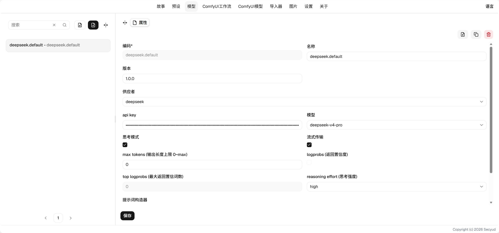

# 模型使用指南

## 配置你的第一个LLM (以Deepseek为例)

1. 创建一个配置，输入编码和名称。编码尽量用英文，作为唯一标识符。
2. 选择供应者，这里我们选择Deepseek。
3. 在api key栏输入你从Deepseek官方获得的apikey。
4. 选择你需要使用的模型，配置思考模式或非思考模式。
5. 点击保存，之后你就可以在故事的模型配置中选择你配好的模型了。

## 属性

* 单回合最大轮次：每回合AI最大输出轮数，显示单回合AI调用工具的次数。至少为2。
* 重试间隔与重试次数：流式返回超过间隔没有新内容时会重试。
* 流式传输：关闭后等待完整响应再返回。
* 构造器：影响世界书的注入方式。
    * 默认构造器
        * 注重缓存命中率，将注入的世界书在相应的历史进行缓存，从而提高命中率。
    * 层级构造器
        * 注重排序，将不同重要程度的世界书按照层级进行注入，从而提高重要世界书的影响。

## 供应者

### OpenAI

* 格式：`chat`为传统的`chat.completions`，`responses`为新版`responses`接口。
* 额外参数：填写一个JSON，会合并进请求体，用于传递接口支持但这里没有暴露的参数。
* 令牌限制：上一轮用量超过此值时提示压缩上下文，填0不检查。

### Deepseek

* 思考模式：关闭后不再返回思考内容，可以设置`temperature`与`top_p`。
* 思考强度：`high`或`max`。
* 最大令牌数：填0则不传。

### Anthropic

* 扩展思考的签名会随思考块一起回传，多轮对话里不要手动清理思考内容。

## 环境变量

程序初始化时，若没有`.env`文件，会自动生成，并随机生成以下值，您可以更改它们。

* `SECRET_SALT` 盐值，一个复杂字符串
* `SECRET_KEYS` 密钥，一个复杂字符串

这些变量涉及到数据库中的api key的加密和解密，请务必妥善处置，以防泄露。

> 密钥只在服务端解密，浏览器拿不到明文。
> 但这两个值一旦丢失，已保存的apikey将无法解密，只能重新填写。
