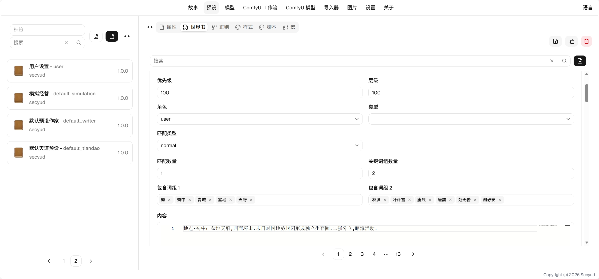
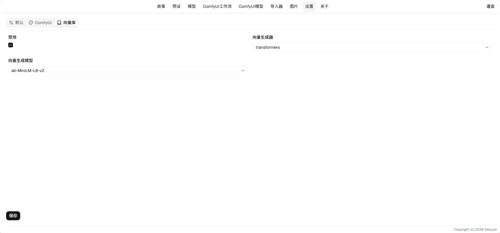

# 世界书使用指南

## 字段说明

* 编码：用于去重，同一预设内编码相同即同一条。
* 顺序：同层级下，世界书放置的先后顺序。
* 层级：世界书放置的顺序，小于100时放置在用户输入前，反之放在用户输入后。
* 角色：世界书内容发送给AI时使用的角色。
    * knowledge (default)：伪装成一次知识查询的结果注入
    * user：用户输入
    * system：系统设定
    * assistant：AI输出
* 类型：决定编辑框的语言识别方式。
* 匹配类型：决定世界书是否应用的匹配方式，详见[匹配](#匹配)。
* 内容，世界书填充至上下文的内容。

## 匹配

### 常驻

总是注入到上下文中，默认注入到第一条用户消息前后。

#### 字段说明

* 最后一条消息：此世界书的内容将放在用户输入的最后一条消息前后。
* 绑定宏：填写一个宏的编码，该宏被勾选时这条世界书不再注入。可以用来做总开关。

### 一般

使用词组匹配，当上下文中包含相应词组时，将会注入

#### 字段说明

* 匹配数量：需要满足的词组数量
* 关键词组数量：总的词组数量
* 包含词组：词组的内容，是一个字符串数组

> 一个词组中，只要有任意一个出现在上下文中，就算匹配成功。
> 当所有词组匹配的数量超过匹配数量，世界书就会被注入。

### 变量

读取变量的指定路径，与其值做完全相等比较，相等时注入。

#### 字段说明

* 路径：变量的路径
* 值：用来比较的值

### 事件

在[一般](#一般)的基础上加入了涉及时间。

#### 字段说明

* 最小日期：包含的最小日期
* 最大日期：包含的最大日期

> 该条目会匹配当前历史变量中的relatedDates，如果其中存在符合条件的日期，才会继续进行关键词匹配，否则不会注入。
> 这个匹配类型要求有相应的世界书，让AI将相关的日期填到relatedDates数组中才会起作用。

### 向量

根据文本计算出的向量进行语义匹配。语义匹配在初始化时需要一定的时间生成向量库，会减慢打开游玩界面的速度。而且效果没有那么出众，很少使用。

与其它匹配类型不同，向量匹配**不是自动触发**的。需要给AI启用世界书工具，由AI主动查询，查询命中的条目才会注入。

#### 设置

##### 字段说明

* 禁用：禁用向量匹配，禁用后无需下载向量模型。禁用时用到向量的工具会返回提示，不会静默失败。
* 向量生成器：向量生成的方式
    * transformers：huggingface 提供的向量生成器，需要一个向量生成模型。
* 条数限制：一次查询最多命中多少条。
* 相似度：命中的最低相似度。
* 缓存条数限制：向量缓存的条目数上限，超出后按最旧清理。

> 世界书的正文会经过宏和正则，与用户输入、AI输出走同一套转化。

## 说明

* 多个预设叠加时，按`预设id + 编码`区分，不同预设的同名条目不会互相覆盖。
* 同一条世界书在多轮对话中只会注入一次。

