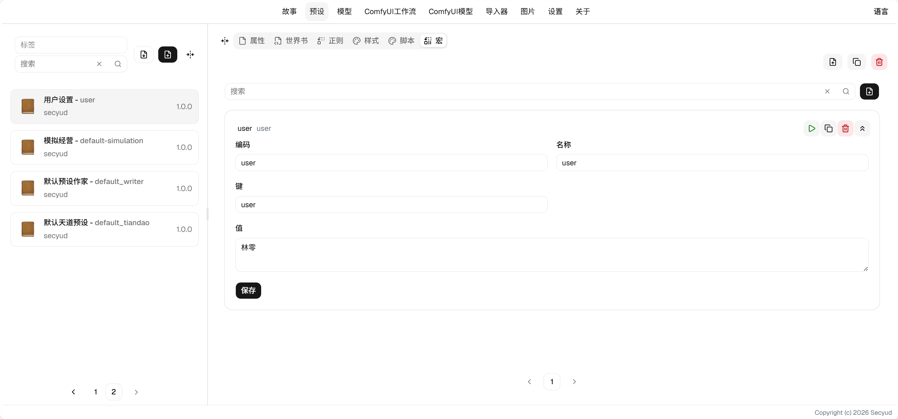

# 宏使用指南

宏是动态模板，用[Eta](https://eta.js.org/docs)求值，输入和输出都会经过宏。

## 字段说明

- 编码：用于去重
- 键：在宏脚本中it对象中的键名
- 值：在宏脚本中it对象中对应键的值
- JSON：值按JSON解析，可以通过字段访问
- 复选：可以同时选中多个宏；不勾选时为单选，同一个键下只能选一个
- 隐藏：不在宏选择器中显示

## 使用方式

假设宏中有配置键为user值为小明的配置。 在任何上下文文本中 (包含用户输入，AI输出，世界书，正则)，使用模板字符串`<%~ it.user %>`将会计算为
`小明`。在被`<%~ %>`包裹的块中，可以使用js函数，例如`<%~ JSON.stringify(it.variables) %>`将会展示`variables`序列化后的文本。

更多的语法文档可以参考[Eta](https://eta.js.org/docs)

## 内置宏

除了在宏页面配置自定义宏，系统中还内置一些宏

- variables: 当前历史的变量

## 选中与覆盖

宏的选中规则同时看编码和键，比其它条目复杂一些。

单选（复选未勾选）：

- 同一个键下只会选中一个编码，没有选择时取第一个，已有选择时保留。
- 选择状态是持久化的，指向已删除的编码时会跳过，不会报错。

复选：

- 禁用状态按**编码**记录，所以相同的编码、不同的键会共享一个开关。
- 不同的编码、相同的键是正常情况，值按依赖顺序覆盖。
- 相同的编码、相同的键会追加到同一个键下。

这是为多预设继承和共享设计的。

> 用JSON宏承载结构化数据，纯文本宏承载提示词片段，是常见的搭配方式。
> JSON宏与文本宏可以共存，取值时字段走JSON，文本拼接走toString。
