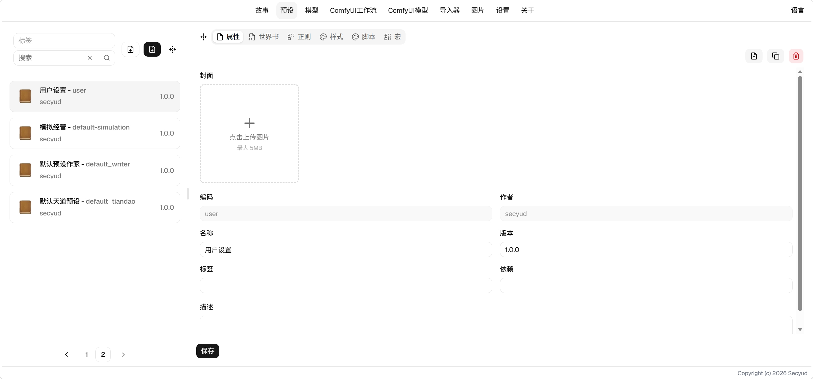
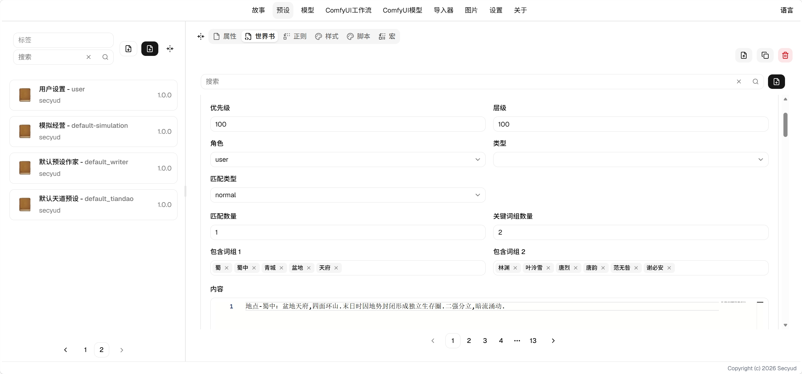
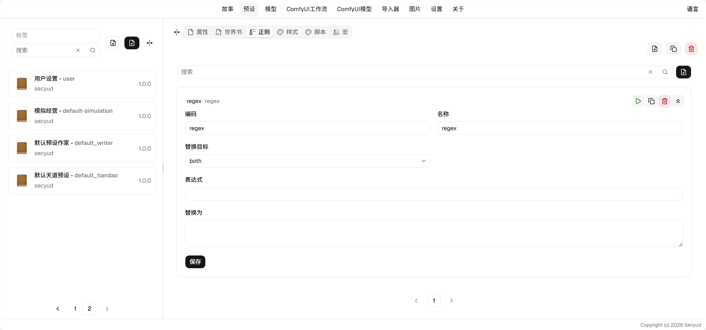

# 预设使用指南

## 配置你的第一个预设

1. 创建一个预设，输入编码和名称。编码尽量用英文，作为唯一标识符。
2. 为你的预设打上标签，例如这个预设包含主题，故事，就打上theme，story的标签，点击保存。
3. 进入[世界书](#世界书)并进行世界书的配置。
4. 进入[正则](#正则)并进行正则的配置。
5. 进入[样式](#样式)并进行样式的配置。
6. 进入[脚本](#脚本)并进行脚本的配置。
7. 进入[宏](#宏)并进行宏的配置。
8. 至此，预设已经全部配置完成，你可以在故事中选择依赖的预设进行游玩。

## 属性

配置预设的基本属性，如封面，标签，版本，依赖等。

### 字段说明

* 封面：上传一张封面图像，用于展示预设的封面。
* 版本：预设的版本，分享时可以对比版本进度。
* 标签：预设的分类，可以有多个标签，方便查阅。
* 依赖：这个预设依赖的其他预设，会随着这个预设加载。

## [世界书](lorebook.md)

世界书提供知识库，可以按照条件匹配相应的内容，作为LLM的上下文传递给AI。

## [正则](regex.md)

正则可以检索上下文，找到匹配的内容进行替换，可以替换输出或者输入的内容。

## [样式](style.md)

样式可以定义常驻的css样式，注入到互动页面中，提供丰富的UI渲染。

## [脚本](script.md)

脚本可以定义js脚本，注入到互动页面中，提供丰富的交互内容。

## [宏](macro.md)

宏可以在生成输出和输入的过程中进行动态的替换。

## Q&A

1. Q: 宏和正则有什么区别？
    * A: 宏可以进行动态的计算和替换，同时替换输出和输入，但只能按表达式进行匹配。正则的匹配能力更强，可以单独替换输出或输入，但只能替换为相对固定的内容。