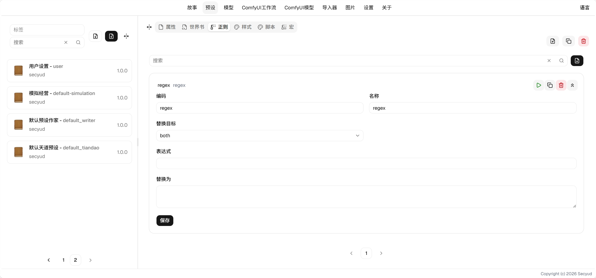

# 正则使用指南

正则用于文本替换，输入和输出可以分别应用。

## 字段说明

* 替换目标：替换输入还是输出，输入即发送给AI的内容，输出即发送给页面进行展示的内容。
* 表达式：填写正则表达式，用于匹配需要传递的内容。
* 替换为：填写替换后的内容，如果为空，将会删除表达式匹配的内容。

## 说明

* 表达式按字面量处理，不解析`/xxx/g`这种写法，直接写`a`或`[abc]`即可。
* 一个预设内可以配置多条正则，按名称顺序依次替换，前一条的结果会进入后一条。
* 多个预设叠加时，正则不做去重，全部依次执行。

> 正则只能替换为固定内容。需要计算或按条件变化的，用[宏](macro.md)。
