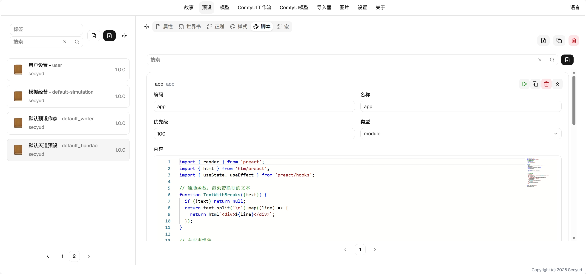

# 脚本使用指南



## 字段说明

* 优先级：决定脚本注入的顺序
* 类型：脚本的类型，决定脚本注入的方式
    * link：以链接的方式引用，内容需填写一个js的url。
    * module：以模块的方式注入页面，所创建的常量会被隔离。
    * importmap：以importmap的方式注入页面，所有的importmap将被合并为一个json，放到`script[type='importmap']`中。
    * application/javascript (default)：以js文本的方式直接注入页面
* 内容：根据脚本的类型填写相应的内容

## 获取变量

初始化

```js
const contentInitData = window.__messageData?.["content"];
// ...
```

监听

```js
function handleMessage(e) {
    if (e.data.type === 'content') {
        setData(d => ({...d, ...e.data.data}));
    }
}

window.addEventListener('message', handleMessage);
// ...
```

当前可用消息：

* content
    * 用于渲染输入，输出，思维链。相应字段如果为undefined， 意味着不改变，而不是清空
    * 结构为```{ input?: string[], output?: string, reasoningContent?: string }```
* variables
    * 用于监控变量的改变，变量改变时需要响应并更新UI。
    * 结构不定，可以是任意结构。