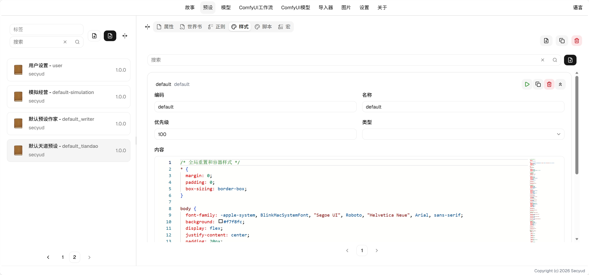

# 样式使用指南

样式用于给互动页面提供基础的视觉效果。

## 字段说明

* 优先级：决定样式注入的顺序
* 类型：样式的类型，决定样式注入的方式
    * link：以链接的方式引用，内容需填写一个css的url。
    * text/css (default)：以css文本的方式直接注入页面
* 内容：根据样式的类型填写相应的内容

## 说明

* 注入到iframe的head中，所有样式对所有预设共享。
* 按优先级升序注入，数字小的先加载。
* 多个预设叠加时，按条目的编码去重。
* 样式与[脚本](script.md)是两条独立的注入通道，同名互不影响。

> 页面结构由脚本绘制，样式只负责外观。两者配合才能做出完整的交互界面。
