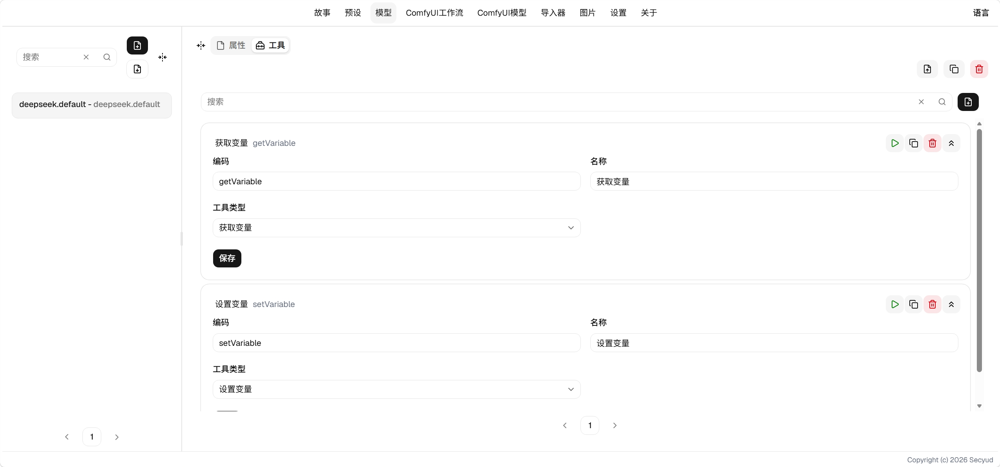

# 工具使用指南

工具相比于手动构造提示词具有更大的灵活性和稳定性。

它可以让AI根据需求获取特定的内容以及记录相应的操作。

## 字段说明

* 工具ID 工具类型，不同的工具有不同的作用。

## 工具类型

### 变量工具

* 设置变量

LLM调用此工具可以在当前输出中设置变量。可以替代variable_changes。 AI设置变量尽量使用这种方式，更稳定。variable_changes
同样保留，但更适合用于构造输入。

* 获取变量

LLM根据变量路径获取变量，不需要手动在世界书或其它地方注入变量。尽量让AI自动调用这个工具获取变量。

### 网页抓取

类似于联网搜索，它会抓取网页，读取关键信息
> 个人不建议用，除非你有特殊需求，比如做知识搜索。

### 自定义脚本

每个预设都可以结合自定义脚本进行工作，设置，使用全局变量，播放媒体，数学计算等等。

### 子Agent

你可以设定自己的子Agent，提供自定义的分析或操作。

* 禁用tags将在子Agent中禁用包含指定tags的预设。
* 禁用预设将在子Agent中禁用所有预设。
* 最大长度可以限制主Agent传递给子Agent的上下文长度。
* 模型可以为子Agent单独设置模型，默认使用故事模型。
* 依赖可以配置子Agent自己的预设依赖，它将与主Agent的依赖合并。同样受Tags禁用限制，但不受禁用预设限制。
* 结构提供一个JSON Schema，AI将会根据描述提供参数。参数可以通过ETA语法访问。
* 描述为AI提供一个行为描述，便于AI理解。