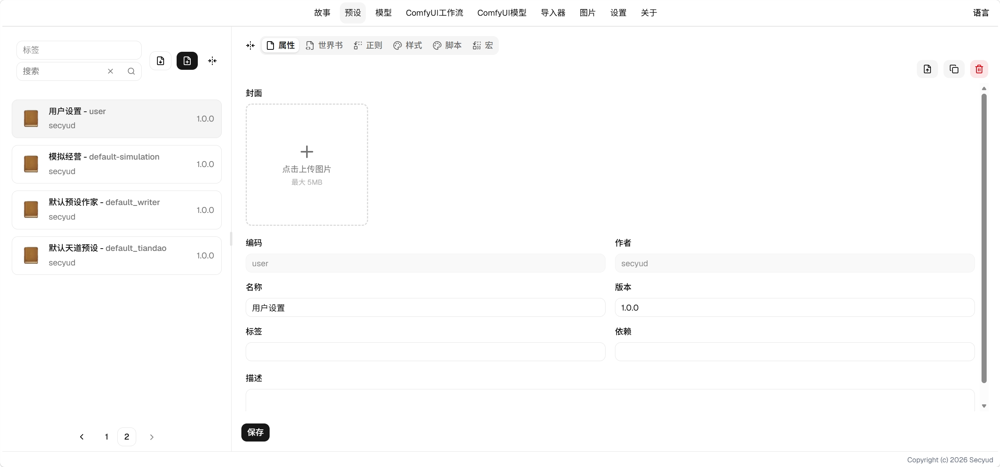
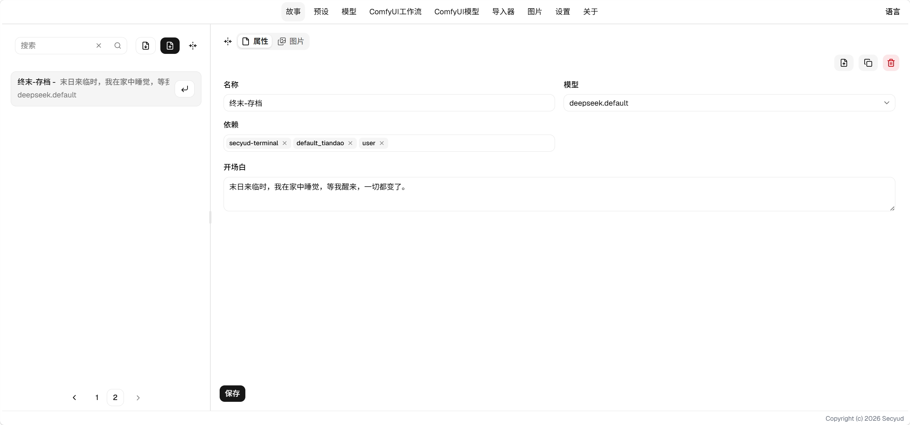
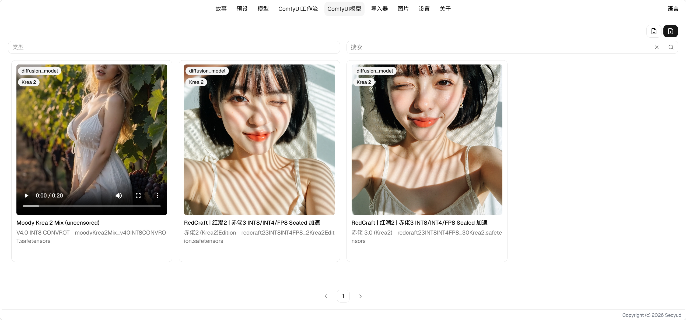
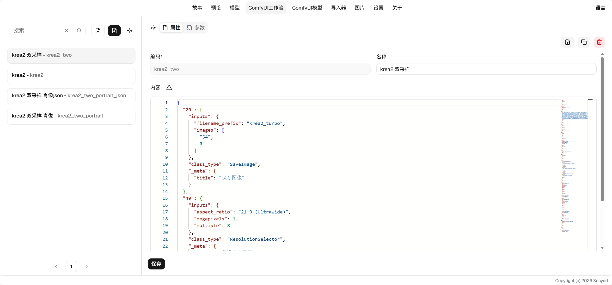

# 使用指南

按顺序配置即可开始游玩：先配模型，再搭预设，然后在故事里选好这两者进入游玩。

## [模型](model/readme.md)

模型提供LLM的配置，你可以在此配置你的API类型，选项以及Key，以供访问LLM。

## [预设](preset/readme.md)

预设是Secyud Tavern的核心功能，提供了交互的所有配置，你可以在此搭建自己的交互舞台。

预设由七种条目组成：世界书提供知识，正则和宏改写文本，脚本和样式画界面，工具给AI提供能力。

## [故事](story/readme.md)

故事是存档的入口，一个故事就是一个存档，你可以在此进行游玩和游览图集。

## [ComfyUI](comfyui/readme.md)

ComfyUI提供了在故事中进行生图的功能。

