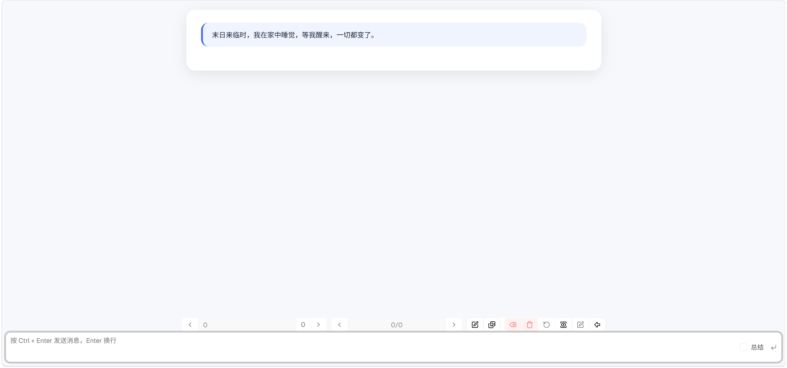

# 故事使用指南

## 属性

### 字段说明

- 模型：在[模型](../model/readme.md)中创建的模型配置，只能选择一个。
- 依赖：在[预设](../preset/readme.md)中创建的预设配置，可以选择多个。
- 开场白：游玩时生成的第一个输入，可以留空。

## 图片

该故事中相关的图片，可以上传，下载，管理故事图片。

## 游玩

点击故事列表项目右边的回车图标，即可进入[游玩界面](realm.md)。

## 记忆

- 若开启了rag选项，可以使用记忆工具。
- 你可以在工具选择器禁用get_memory，从而实现开始轮只记录，不回忆。
- 在总结之后，你可以开启get_memory，让AI自动获取记忆。

## 上下文

一次生成送给AI的上下文，是**从最后一个总结段落到现在**，不是全部历史。

* 勾选输入框旁的总结，这条输入会被标记为总结段，之后的对话从这里开始。
* 所以在长对话里，定期总结是控制上下文长度的主要手段。
* 世界书和记忆的注入也发生在这一步，可以在游玩界面用查看上下文检查实际送出的内容。

## 条目

故事本身只有模型、依赖（预设）和属性，其余内容都是条目：

* 记忆：记忆工具写入的内容。
* 图片：故事图集，可以手动上传，ComfyUI生成后也会自动回传到这里。
