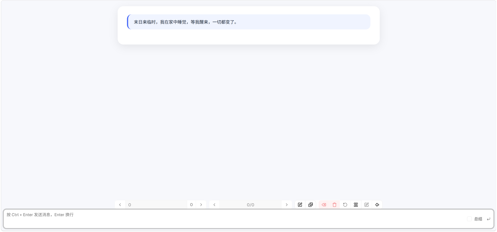

# 游玩指南

没有任何预设时，是一片空白，无法直接进行互动，你需要至少一个展示脚本才能看到交互页面。 这意味着所有的交互内容都是可定制的。

## 功能说明

* 历史翻页：跳转到相应的互动历史。
* 输出翻页：跳转并切换输出，切换输出时会改变上下文。
* 生成图片：使用[ComfyUI](../comfyui/readme.md)的图片生成功能。
* 图片：[故事](readme.md)的图集，在这里可以以弹窗的方式打开。
* 删除回复：删除AI的当前输出。
* 删除历史：删除当前历史的输入和输出。
* 重新生成：重新生成AI回复。
* 查看上下文：查看当前的上下文内容，并统计字数。
* 编辑当前历史：编辑当前历史内容，可以编辑输入，输出以及变量。
* 回到主页：返回故事页面

* 输入框：输入想要发送的内容。
* 总结：标识是否是总结，如果是总结，后面的对话将会从此开始，不会附带前文。